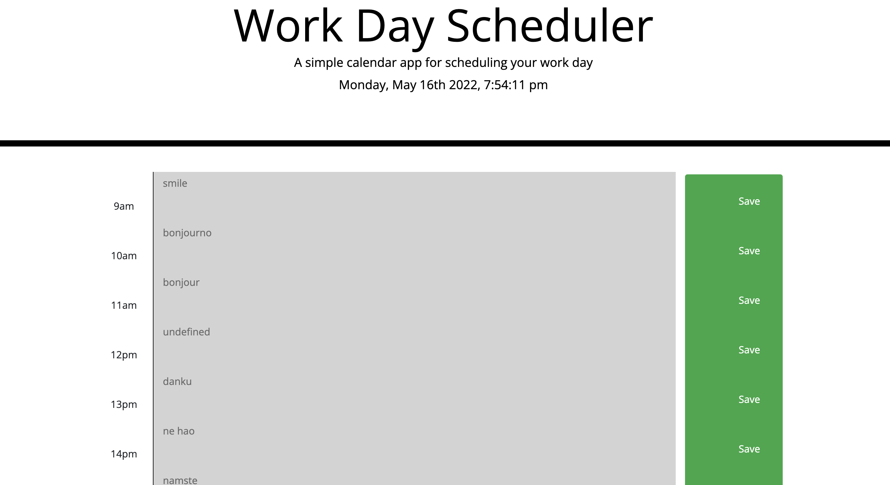

# Day-Planner

## Description

Created a day planner which displays the date and time using moments.js and bootstrap.

the day planner consists of three columns:

- first column states the time
- second column states the notes you want to add for events at each time frame
- third box is used to save the notes

As the time passes the set time frame boxes the color of the box will change to confirm if the event has passed or not.

The color scheme consists of red -present, green-future and grey-past

## Deployed URL

You can find the application link [here](https://saleha22.github.io/Day-Planner/)

## Screenshots

